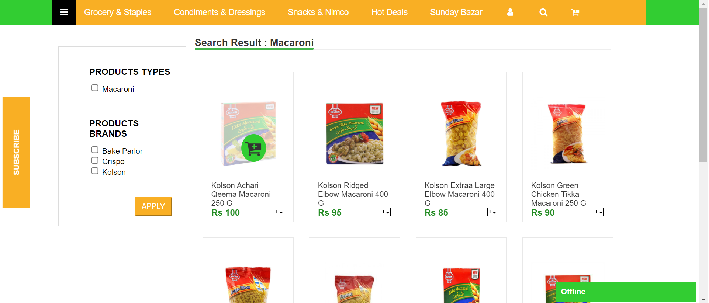

# Front-End-for-Keryana

This project creates a simple front-end for a grocery website ``Keryana.pk`` using HTML and CSS. The page displays different products to the user while each product's 
description is shown. ``HtmlPage.html`` is the html file while ``StyleSheet1.css`` contains the styling for the html page. The front-end looks as follows.

